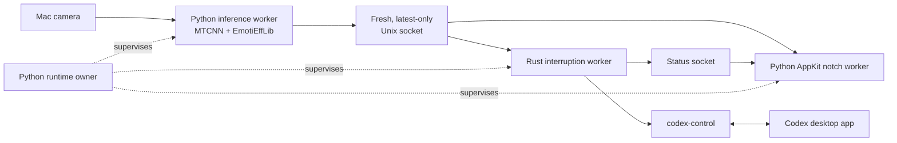

# Uncover

Uncover is an on-device facial-expression layer for the Codex desktop app on
macOS. It watches the primary face visible to the Mac camera, shows the current
expression beside the built-in display notch, and can give an active Codex task
carefully filtered nonverbal context.

The project exists to restore one signal that text chat normally loses: a user
may look confused, upset, or surprised before they explicitly type that
reaction. Uncover makes that signal visible without streaming camera frames to
a server or retaining a facial-history database.

> [!IMPORTANT]
> Uncover is currently a source-run macOS application, not a signed `.app`
> bundle or installer. Setup requires Python, Rust, and a terminal. Native
> packaging, launch-at-login, signing, and camera entitlements are future work.

## What it does

- Runs EmotiEffLib expression inference locally through ONNX Runtime.
- Detects faces with MTCNN and analyzes only the largest eligible face.
- Recognizes anger, contempt, disgust, fear, happiness, neutral, sadness, and
  surprise.
- Shows only the single highest-scoring eligible non-neutral expression beside
  the MacBook notch.
- Smooths initial display changes over two consecutive inference results while
  clearing promptly when no expression remains eligible.
- Never shows a neutral emoji.
- Never interrupts Codex for happiness, surprise, or neutral.
- Interrupts only for sustained negative expressions, then resumes the same
  Codex task with an uncertainty-aware context message.
- Keeps inference, notch rendering, and Codex control in separate worker
  processes so one slow component does not block the others.

An interruption message looks like this:

> Nonverbal context update: the user appears sad (mild; 35%). This was inferred
> from their facial expression and may be imperfect. Continue the existing task
> with this context in mind.

Facial-expression inference is probabilistic. Uncover provides context, not a
claim about the user's internal emotional state.

## How it works



### 1. Capture and inference

One Python worker owns the camera and model. A background capture thread keeps
only the newest frame, preventing camera buffers from feeding old facial
expressions into inference. By default:

- inference starts at most once every `0.16` seconds;
- MTCNN requires `0.90` face-detection confidence and a 40-pixel minimum face;
- the largest eligible face is selected;
- EmotiEffLib runs `enet_b0_8_best_afew` with its ONNX backend;
- no-face state is published after `0.8` seconds without an eligible face.

The worker publishes normalized scores, a bounded face box, and timing metadata.
It never publishes image pixels.

### 2. Latest-only local stream

Inference publishes complete snapshots over an owner-only Unix-domain socket.
The notch and interruption workers subscribe independently. Each subscriber has
one pending slot, so an older unread event is replaced by the newest event
instead of building a backlog.

Events older than the `0.75`-second freshness window are rejected. Disconnects,
stale input, and inference restarts reset temporal state; missing time can never
complete an interruption hold.

### 3. Notch presentation

The AppKit worker renders a transparent, non-activating panel around the built-in
display notch. It does not take keyboard focus.

The default display policy is:

- a non-neutral expression enters strictly above 30%;
- only the highest-scoring eligible expression is shown;
- a displayed expression remains eligible down to 25% to avoid threshold
  chatter;
- showing or switching requires two consecutive matching results;
- no eligible expression, neutral, no-face, stale input, or disconnect clears
  the icon;
- interruption progress and outcomes temporarily emphasize the affected icon.

The inference scores themselves are not averaged with an EMA. Smoothing happens
at the display-transition and interruption-policy layers.

### 4. Conservative Codex interruption

The Rust worker independently evaluates the same fresh score stream. Only anger,
contempt, disgust, fear, and sadness are eligible. The same eligible negative set
must remain strictly above 30% for one continuous second.

When the hold completes, the worker:

1. Selects exactly one active Codex turn. If none or more than one are active, it
   refuses to guess.
2. Requests interruption of that turn.
3. Waits up to two seconds to confirm the original turn stopped.
4. Starts a replacement turn in the same task with the nonverbal context.

An unchanged expression is sent once per episode. The policy rearms only after a
one-second negative-free baseline and observes a 15-second cooldown between
different dispatched expression sets. An uncertain Codex write is treated as
possibly successful and is not blindly repeated.

The agent context may include multiple sustained negative expressions, but the
notch still displays only the highest-scoring one.

## Current limitations

Uncover currently does **not** provide:

- face identity recognition or matching against a reference face;
- personalized neutral-expression calibration;
- eye tracking or gaze estimation;
- identity continuity when multiple people are visible;
- a signed native application, installer, or automatic startup;
- a production notch UI for non-notched or external-only displays;
- cloud inference, emotion history, analytics, or video recording;
- inference adapters other than EmotiEffLib.

If multiple faces are visible, the largest eligible face is treated as the
device user.

## Requirements

- macOS
- A built-in notched display for the visual overlay
- Python 3.11 or newer
- Rust 1.91 or newer with Cargo
- Git
- Xcode Command Line Tools
- The Codex desktop app for live interruption mode
- Internet access during installation and the first model load

The first real inference run downloads the configured EmotiEffLib model into
`~/.emotiefflib`. Python and Cargo also download their declared dependencies
during setup.

## Installation

### 1. Install system tooling

Install the Xcode Command Line Tools if they are not already available:

```bash
xcode-select --install
```

Install Python 3.11+ using your preferred Python manager. Verify it:

```bash
python3 --version
```

Install Rust through [rustup](https://rustup.rs/), then install a compatible
toolchain:

```bash
rustup toolchain install 1.91.1 --profile minimal --component clippy,rustfmt
rustup default 1.91.1
rustc --version
```

### 2. Clone the repository

```bash
git clone https://github.com/RPD123-byte/uncover.git
cd uncover
```

### 3. Create the Python environment

```bash
python3 -m venv .venv
source .venv/bin/activate
python -m pip install --upgrade pip
python -m pip install -e '.[inference,macos,test]'
```

The full inference environment includes PyTorch through `facenet-pytorch` and
can take several minutes to install.

### 4. Build the Rust interruption worker

```bash
cargo build \
  --locked \
  --release \
  --manifest-path src/native/expression_interruption/Cargo.toml
```

The runtime automatically discovers this release binary. During development it
can also use a debug build or fall back to `cargo run`.

### 5. Verify the installation without camera or Codex access

```bash
uncover-expression \
  --mode demo \
  --no-manage-codex-gui
```

Demo mode cycles synthetic expressions through the real production stream,
notch policy, and Rust interruption policy. It reports `would_send` instead of
mutating a Codex task. Press `Ctrl-C` to stop it.

On a Mac without a supported notch, use the JSON headless renderer:

```bash
uncover-expression \
  --mode demo \
  --headless-notch \
  --no-manage-codex-gui
```

## Camera permission

The first camera-backed run requests access through AVFoundation. If access was
denied, open:

**System Settings → Privacy & Security → Camera**

Enable camera access for the terminal or Python host used to launch Uncover,
then restart the command. Do not run the old experiment and the production
runtime simultaneously; two processes competing for the same camera can produce
failures or misleading latency.

## Running Uncover

### Test the real camera without changing Codex

Start here after installation:

```bash
uncover-expression \
  --mode dry-run \
  --no-manage-codex-gui
```

This runs the real camera, MTCNN, EmotiEffLib, notch, local streams, and
interruption policy. It does not connect to or mutate Codex.

### Run only camera inference and the notch

```bash
uncover-expression --mode display-only
```

Display-only mode does not start the Rust interruption worker and does not
connect to Codex.

### Run the complete application

Open the Codex desktop app, then run:

```bash
uncover-expression --mode normal
```

Normal mode starts all three workers and enables live interruption. By default,
`codex-control` gracefully relaunches the Codex desktop app once during Uncover
startup so it can attach to the shared control daemon. That relaunch is a startup
operation only; stopping Uncover does not quit or reopen Codex.

For an externally managed Codex daemon, disable GUI lifecycle management:

```bash
uncover-expression \
  --mode normal \
  --no-manage-codex-gui
```

Live interruption applies only while a Codex turn is actively running. Without
`--thread-id`, exactly one turn must be active. If several tasks are generating
simultaneously, Uncover publishes `multiple_active_turns` and does nothing.

### Target a known Codex task

```bash
uncover-expression \
  --mode normal \
  --thread-id YOUR_CODEX_THREAD_ID
```

This limits interruption to the configured task. It does not create a task or
choose a different one when the target has no active turn.

### Replay one or more images through the real model

This is useful for model and policy diagnostics:

```bash
uncover-expression \
  --mode dry-run \
  --image /absolute/path/to/face-1.jpg \
  --image /absolute/path/to/face-2.jpg \
  --headless-notch \
  --no-manage-codex-gui
```

The images repeat in the order supplied. This mode still runs the production
EmotiEffLib adapter; it only replaces the camera source.

## Runtime modes

| Mode | Input | Notch | Codex mutation |
| --- | --- | --- | --- |
| `normal` | Camera or `--image` | AppKit by default | Enabled |
| `demo` | Synthetic patterns | AppKit by default | Never |
| `dry-run` | Camera or `--image` | AppKit by default | Never |
| `display-only` | Camera or `--image` | AppKit by default | Interruption worker omitted |

Add `--headless-notch` to any mode to print notch state as JSON instead of
creating the AppKit overlay.

## Main command options

```text
--mode {normal,demo,dry-run,display-only}
--camera INDEX
--image PATH
--headless-notch
--interruption-binary PATH
--thread-id ID
--no-manage-codex-gui
--threshold SCORE
--hold-seconds SECONDS
```

- `--camera` selects the OpenCV/AVFoundation camera index; default `0`.
- `--image` is repeatable and replaces camera capture with decoded images.
- `--threshold` changes both notch entry and negative interruption eligibility;
  default `0.30`. The CLI keeps the notch exit threshold five percentage points
  lower.
- `--hold-seconds` changes the continuous negative-expression hold; default
  `1.0`.
- `--interruption-binary` supplies an explicit compiled Rust worker. The
  `UNCOVER_INTERRUPTION_BINARY` environment variable provides the same override.
- `--no-manage-codex-gui` prevents the startup Codex relaunch.

Run `uncover-expression --help` for the authoritative option list.

## Important defaults

| Setting | Default |
| --- | ---: |
| EmotiEffLib model | `enet_b0_8_best_afew` |
| Inference interval | `0.16 s` |
| Face confidence | `0.90` |
| Minimum face size | `40 px` |
| No-face timeout | `0.8 s` |
| Stream freshness | `0.75 s` |
| Notch entry / interruption threshold | `> 0.30` |
| Notch exit threshold | `< 0.25` clears |
| Notch show/switch confirmation | `2 readings` |
| Negative interruption hold | `1.0 s` |
| Different-expression cooldown | `15 s` |
| Worker restart limit | `5 per 60 s` |

The lower-level defaults live in
[`RuntimeConfig`](src/uncover/runtime/config.py). The main CLI intentionally
exposes only the settings currently needed for operation and tuning.

## Privacy and local security

- Camera frames and face crops remain inside the inference process.
- Uncover does not write frames, crops, or expression history to disk.
- Stream messages contain normalized scores, face-box coordinates, timestamps,
  provider name, and inference duration.
- Each launch creates a new unpredictable `0700` directory under the macOS
  per-user temporary directory.
- Unix socket files are owner-only and are removed during orderly shutdown.
- Streams are latest-only and non-durable; stale events are discarded rather
  than replayed.
- The only expression data forwarded into Codex is the generated nonverbal
  context message when an interruption policy fires.

Model weights and ordinary package caches are persisted by their respective
tools. EmotiEffLib stores downloaded weights in `~/.emotiefflib`.

## Process lifecycle

The `uncover-expression` process is the runtime owner. It launches inference,
notch, and—when enabled—interruption workers in separate process sessions,
aggregates structured health, and restarts a failed worker with bounded
backoff.

Pressing `Ctrl-C`:

1. stops new work;
2. sends termination only to worker process groups owned by Uncover;
3. waits up to five seconds;
4. escalates only against workers that did not exit;
5. removes the launch's temporary runtime directory.

It does not recursively kill terminal descendants, the Codex desktop app, or the
shared Codex daemon.

## Troubleshooting

### `uncover-expression: command not found`

Activate the virtual environment:

```bash
source .venv/bin/activate
```

Or run the entry point directly:

```bash
.venv/bin/uncover-expression --mode demo --no-manage-codex-gui
```

### `Camera denied` or `Allow camera access`

Enable the launching terminal/Python host in **System Settings → Privacy &
Security → Camera**, then restart Uncover.

### `Camera unavailable`

Close other camera applications, confirm `--camera 0` is correct, and ensure an
experiment process is not still running.

### `Display unsupported`

The AppKit overlay needs a usable macOS notch safe area. Use
`--headless-notch` for diagnostics on unsupported displays.

### The notch shows no expression

- Scores must be strictly above the entry threshold.
- The same top candidate must appear in two consecutive inference results.
- Neutral is intentionally hidden.
- Only the highest-scoring eligible non-neutral expression is shown.

Use a lower diagnostic threshold if needed:

```bash
uncover-expression \
  --mode dry-run \
  --threshold 0.25 \
  --no-manage-codex-gui
```

### The notch works but Codex is not interrupted

- Only negative emotions are interruption-eligible.
- The eligible negative set must remain stable for the full hold duration.
- A Codex response must currently be running.
- Exactly one active turn must exist unless `--thread-id` is configured.
- Demo and dry-run modes never mutate Codex.
- With `--no-manage-codex-gui`, the Codex control daemon must already be
  available.

Inspect the structured JSON logs for `no_active_turn`,
`multiple_active_turns`, `interrupt_failed`, or `restart_failed`.

### Startup repeatedly rebuilds Rust

Build the release worker once:

```bash
cargo build \
  --locked \
  --release \
  --manifest-path src/native/expression_interruption/Cargo.toml
```

Or pass its path explicitly:

```bash
uncover-expression \
  --mode normal \
  --interruption-binary \
  src/native/expression_interruption/target/release/uncover-expression-interruption
```

## Development and verification

Install all development dependencies:

```bash
source .venv/bin/activate
python -m pip install -e '.[inference,macos,test]'
```

Run the default Python suite:

```bash
ruff check src tests
ruff format --check src tests
pytest
```

Run Rust formatting, linting, and tests:

```bash
cargo fmt \
  --manifest-path src/native/expression_interruption/Cargo.toml \
  -- --check
cargo clippy \
  --manifest-path src/native/expression_interruption/Cargo.toml \
  --all-targets \
  -- -D warnings
cargo test \
  --manifest-path src/native/expression_interruption/Cargo.toml
```

Run the real EmotiEffLib image pipelines:

```bash
UNCOVER_RUN_MODEL_TESTS=1 pytest tests/model
```

These tests download checksum-pinned, licensed Wikimedia Commons images into a
temporary pytest directory and remove them afterward.

Run pixel-level AppKit acceptance tests on the target Mac:

```bash
UNCOVER_RUN_VISUAL_TESTS=1 pytest tests/visual
```

Run the opt-in live Codex test:

```bash
UNCOVER_RUN_LIVE_CODEX_TESTS=1 pytest tests/live
```

The live test creates an isolated Codex fixture task, performs a real
interrupt/restart, and always attempts fixture cleanup. It does not relaunch the
Codex GUI.

## Repository layout

```text
src/
├── uncover/
│   ├── emotion/       # Canonical expression schema
│   ├── inference/     # Camera, EmotiEffLib adapter, and inference worker
│   ├── notch/         # Display policy, AppKit renderer, and notch worker
│   ├── runtime/       # Configuration, health, supervision, and main CLI
│   └── stream/        # Versioned local snapshot protocol and Unix sockets
└── native/
    └── expression_interruption/
        └── src/       # Rust policy, Codex dispatch, status, and stream client
```

`src/` is the supported production path. The ignored `experimentation/` folder
contains historical prototypes only and is never imported, packaged, or used by
the production runtime.

Additional design and capability details live in
[`openspec/changes/productionize-expression-interruption`](openspec/changes/productionize-expression-interruption).
The tagged `codex-control` dependency process is documented in
[`docs/codex-control-versioning.md`](docs/codex-control-versioning.md).
